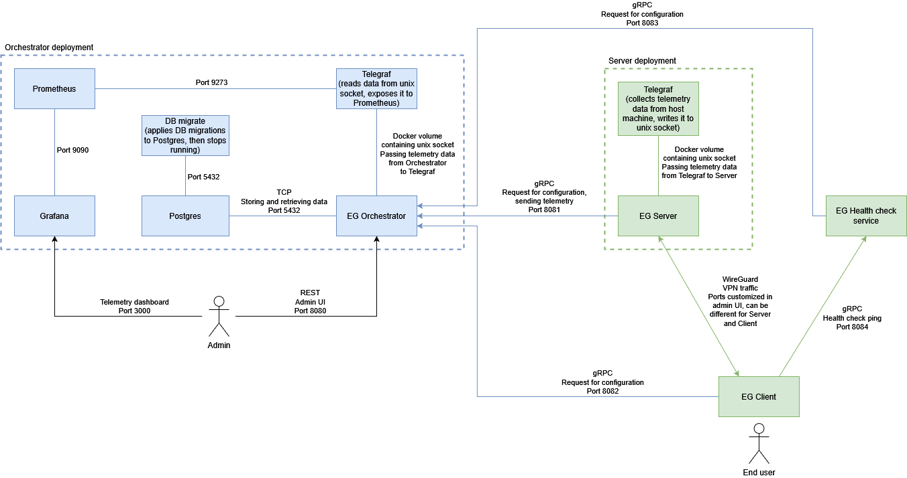

\newpage

# I. Overview

## Archive Content

```bash
grafana/                     # Grafana configuration
previous-db/                 # Empty directory to insert database dump from
                             # previous version
prometheus/                  # Prometheus configuration
telegraf/                    # Telegraf configuration
compose.yaml                 # Compose File
dbconfig.yaml                # Database migration configuration
egvpn                        # egvpn Tool Binary
entguard-v1.15.0-guide.pdf   # EntGuard Guide (this document)
generate-dev-certs.sh        # Script which generates self-signed
                             # TLS certificates (for evaluation)
LICENSE                      # License file
NOTICE                       # Notice file complementing license
release-notes.pdf            # Release notes
```

EntGuard additionally uses the following docker images. They can be pulled from
GitHub container registry.

```bash
ghcr.io/entguard/eg-db-migrate:1.15.0.tar     # Database migration Docker
                                              # Image
ghcr.io/entguard/eg-healthcheck:1.15.0.tar    # EG-HC Docker Image
ghcr.io/entguard/eg-orchestrator:1.15.0.tar   # EG-O Docker Image
ghcr.io/entguard/eg-server:1.15.0.tar         # EG-S Docker Image
```

## EntGuard Components

* EntGuard Orchestrator, or **EG-O**, is a service for configuring VPN servers and
clients. It stores client & server configurations and provides them as well.

* EntGuard Server or **EG-S**, is a service that receives a VPN configuration from EG-O
and applies it.

* EntGuard Healthcheck service or **EG-HC**, is a service that receives a list of valid
user sessions from EG-O and responds to healthcheck pings.

* **egvpn** - is a tool to help with configuring EG-S and EG-HC.

* EntGuard Client or **entguard**, is an app that receives a VPN configuration
from EG-O, creates tunnel and applies configuration to it.

## Deployment Diagram

Firstly, the system administrator adds the **EntGuard Server**, **EntGuard
client** and optionally **EntGuard Healthcheck service** configurations to
**EntGuard Orchestrator**, using the Management UI. Then, the **EntGuard
Server**, **EntGuard Healthcheck service** and **EntGuard client** apps make
requests for acquiring the config. After that, **EntGuard client** and
**EntGuard Server** can apply the required config and use it to create a tunnel
with each other. If the **EntGuard Healthcheck service** is configured, the
**EntGuard client** sends healthcheck pings to the **EntGuard Healthcheck
service**.



## Authentication

EntGuard uses three different authentication mechanisms:

- **BasicAuth**: When requesting a VPN configuration, Clients (EG-C) should provide
a username and password, which was assigned to them. Since it is one request and
one response, BasicAuth is used.
- **TLS**: Servers (EG-S) are keeping a connection with the Orchestrator (EG-O), so for
machine-to-machine communication, a TLS based authentication is used.
- **JWT**: JWT based authentication is used for the interaction with the Management UI.

\newpage

# II. EntGuard Orchestrator (EG-O)

EntGuard Orchestrator is used for orchestrating EntGuard Server, EntGuard
Healthcheck service and EntGuard client, while serving the Management UI.

## Prerequisites {#prerequisites-eg-o}

- [Install Docker](https://docs.docker.com/engine/install/) (minimal version 24.0.0)
- [Install Docker Compose](https://docs.docker.com/compose/install/) (minimal version 2.20.0)

You may be required to preface each `docker` command in this guide with `sudo`. If you want to avoid this,
follow the steps in the [Docker post-installation guide](https://docs.docker.com/engine/install/linux-postinstall/).

Before you start, you will need to pull (or build) the EntGuard Orchestrator image from the GitHub container registry:

```bash
$ docker pull ghcr.io/entguard/eg-orchestrator:1.15.0
```

Also, you will need to pull (or build) Database Migration image:
```bash
$ docker pull ghcr.io/entguard/eg-db-migrate:1.15.0
```

You need to acquire FQDN and a valid TLS certificate for EG-O gRPC communication. You
can get them using [Let's Encrypt](https://letsencrypt.org/) or by using your own
certificates. This certificate will be also needed by EG-S and should be added with
egvpn tool to the EG-S config.

You can test EG-O by using self-signed certificates.
For development certificate generation is used [mkcert](https://github.com/FiloSottile/mkcert) (version 1.4.1).
To generate them, use the bash script provided in the `provisioning/docker` directory:

```bash
$ cd provisioning/docker
$ ./generate-dev-certs.sh
```

It will download the `mkcert` and generate the certificates.

**NOTE: Do not use self-signed certificates for production deployments.**

## Planning

Designing your future network is an important step. Before you proceed or after EG-O is
configured, take a time and plan the structure of your future VPN configuration. Minimal
list of the questions you need to answer:

- What will be the IP address of the VPN server interface?
- What IP addresses will be assigned to VPN client's interfaces?
- Should all clients be able to send packets to the outside of your VPN network?

Example scenario:

*The plan is to have the VPN server, with the interface address `10.10.10.1/24` and two
clients with internal addresses `10.10.10.7/24` and `10.10.10.8/24`. The first client should
only be able to access the internal network, using the VPN tunnel. The second client should
have access to the external network (the Internet) through the tunnel. Therefore, the list
of allowed IP addresses for the first client should only contain the internal network
`10.10.10.0/24`.*

*If you want to add another server and split users into a new VPN subnet, you could do it this way:
for example, if you have VPN server with interface `10.10.10.0/24` and clients within this subnet,
you could delete this server and create two VPN servers with interface addresses `10.10.10.0/25` and `10.10.10.128/24`
and assign client interface addresses to `10.10.10.1/25 - 10.10.10.127/25` if you want them to create tunnel with the first server or
assign them to `10.10.10.129/25 - 10.10.10.255/25` if you want them to create tunnel with the second server.*

## Install using Docker Compose

If you want to customize the configuration, take a look into the [Configuration](#configuring-eg-o)
section.

Using [Docker Compose](https://docs.docker.com/compose/), you can easily configure and
run your EntGuard Orchestrator instance. The `compose.yaml` file is included in the `provisioning/docker` directory.
Therefore, make sure you are in that directory and then run:

```bash
$ docker compose up --detach
```

At this point, new database migrations are executed and your EG-O instance should be running.

NOTE: If your database credentials are different from the default, you should also update username and password in the dbconfig.yaml file.

## Open Management UI 

To log into EntGuard Management UI:

1. Open your web browser and go to https://localhost:8080/. 
2. Log in as the default admin user:
   - Username: `admin`
   - Password: `5Bt3kp0ItQ;9`

**NOTE: We strongly recommend to add a new admin user with a new password and delete the initial one.**

## Configuration {#configuring-eg-o}

You can configure EG-O by modifying `compose.yaml` file.

### Database credentials

Even though the `db` service defined in `compose.yaml` file does not expose any ports
to the host machine, it is always a good idea to change default passwords. To do that, find
next lines under `db` service configuration and update values:
```yaml
"POSTGRES_USER":        "postgres"
"POSTGRES_PASSWORD":    "postgres"
```

After that, let `web` service know about the change by updating corresponding values:
```yaml
"PGUSER":     "postgres"
"PGPASSWORD": "postgres"
```

NOTE: a username and password should also be updated in the dbconfig.yaml file.

NOTE: changes to the compose.yaml file will only take effect if you are doing them right before the first run, or you've stopped containers and removed a database volume using:
```bash
# !This will remove all saved data from the database and Grafana
# credentials!
$ docker compose down --volumes
```

### Database encryption

Sensitive data (private keys, TOTP secrets, ...) is stored in encrypted form in the database (except for passwords, which are stored in hashed form, using bcrypt). The EntGuard orchestrator encrypts/decrypts the data, so the data is encrypted in transit between the orchestrator and the database (the database itself does not do encryption and it does not have access to the encryption key). The orchestrator uses AES encryption with Galois counter mode (authenticated encryption) to ensure both confidentiality and authenticity of the data.

Before deploying the EntGuard orchestrator, you need to generate the encryption key. You can generate it using:
```bash
$ openssl rand -out /path/to/keyfile 16
```
The command will generate an encryption key for AES-128 (replace the `/path/to/keyfile` with the actual path where you want to store the file and optionally replace the number 16 with 24 for AES-192 or 32 for AES-256).

Then find the following lines in the `compose.yaml` file, in the `volumes` section of the `web` service:
```yaml
- type: bind
  source: "./db-encryption-key/db-encryption-key.key"
  target: "/etc/entguard/db-encryption-key/db-encryption-key.key"
```
and change the `source` to the path of the encryption key that you generated above (do *not* change the `target` path).

#### Changing encryption key

If you want to change the encryption key, follow these steps:

1. Preparation:
   - Note where the old key is stored.
   - Generate a new key (do not overwrite the old key at least until step 4.).
   - It may be a good idea to backup the database and the keys before proceeding.

2. Stop the EntGuard orchestrator container:

   ```bash
   $ docker stop eg-orchestrator
   ```
   NOTE: Stopping the orchestrator is important. If you try to reencrypt the database while the orchestrator is still running, it may lead to database corruption and data loss.

   NOTE 2: This command stops only the EntGuard orchestrator container. The other containers (most importantly Postgres container) are still running. This is important so the `egvpn` tool in the next step can access the database.

3. Use `egvpn crypt` in the `reencrypt` mode to reencrypt the database:

   ```bash
   $ egvpn crypt --db-host=hostaddress --mode=reencrypt \
     --old-key-path=/path/to/oldkeyfile --new-key-path=/path/to/newkeyfile
   ```
   This decrypts the database with the old key and immediately encrypts the database with the new key.
   (Replace `/path/to/oldkeyfile` and `/path/to/newkeyfile` with the actual paths and replace `hostaddress` with the actual address where the database is located. You can use `$ egvpn crypt --help` for more help).

4. Find the `source` path for encryption key in the compose file (as mentioned above) and change it to the path of the file with the new encryption key. (Or alternatively overwrite the old key file with the new key file.)

5. Bring down the orchestrator deployment and start it again to apply the changes made to the compose file.

   NOTE: Do NOT run `docker compose down` with the `--volumes` option, that would delete the database!
   
   ```bash
   $ docker compose down
   $ docker compose up -d
   ```

### TLS auth for EntGuard Server

By default, root certificate for TLS auth is stored in the database to keep valid all
issued certificates. It will be automatically generated on the first run.

You can explicitly tell to regenerate root certificate used for TLS authentication of
EntGuard Servers by setting:
```yaml
"VPN_ORCHESTRATOR_RPC_REINIT_CERT_PROVIDER": "true"
```

Note that this will invalidate all previously issued certificates for authentication.

### Port mappings

EG-O exposes different ports for different types of connection:

* for Management UI (default value is `8080`)
* for EG-S gRPC requests (default value is `8081`)
* for EG-C gRPC requests (default value is `8082`)
* for EG-HC gRPC requests (default value is `8083`)

It is possible to change which ports will be used by EG-O on the Docker host. To do that,
you will need to update the port mappings in the `compose.yaml` file. For example,
to change the Management UI port value from `8080` to `8001`, simply update the line
with your selected mappings:

```yaml
# Ports mapping format: "HOST_PORT:CONTAINER_PORT"

# Before
- "8080:8080"

# After
- "8001:8080"
```

If you change the internal EG-O container ports, do not forget to update corresponding environment variables!

### Certificates Path

In the default configuration, EG-O is set to load self-signed certificates from
the `./dev-certs` directory. To mount your certificates from any other location, find
the following lines in the `compose.yaml` file:

```yaml
volumes:
  - type: bind
    source: "./dev-certs/grpc-server-cert.pem"
    target: "/etc/entguard/ssl/grpc-server-cert.pem"
  - type: bind
    source: "./dev-certs/grpc-server-key.pem"
    target: "/etc/entguard/ssl/grpc-server-key.pem"
```

and update the source path for files.

If you change "target" path, do not forget to update corresponding environment variable.

These certificates are used for both gRPC API and REST API (TLS).

#### Updating certificates

To update the certificates, simply overwrite the existing certificate files on the disk with the new certificate files.

Then you need to restart EG-O to apply the new certificates:
```bash
$ docker compose restart
```
If the new certificates are signed by the same certificate authority that also signed the old certificates, then you are done.
Otherwise you need to update the root CA certificate for the EG-S so it can verify the EG-O's certificates.
To do this, follow the instructions in the [Updating root CA certificate](#updating-root-ca-certificate)
section of the *EntGuard Server* chapter.

### Limiting gRPC and REST API Requests to EG-O

You can control the number of processed **gRPC requests** to EG-O from EG-C, by configuring the RPC rate limiting
environment variables:

```yaml
"VPN_ORCHESTRATOR_RPC_RL_SIZE":    "500"
"VPN_ORCHESTRATOR_RPC_RL_RATE":    "10"
```

To limit the rate the [token bucket](https://en.wikipedia.org/wiki/Token_bucket)
algorithm is used.

By default, the size of the bucket is set to 500 tokens, and each second it will be
refilled with 10 tokens. This means that if 500 new requests will arrive at one second,
then in the next second, only 10 requests will be processed.

Similarly, you can control the number of processed **REST requests** to EG-O REST API, by configuring the REST rate limiting
environment variables:

```yaml
"VPN_ORCHESTRATOR_REST_RL_SIZE":  "500"
"VPN_ORCHESTRATOR_REST_RL_RATE":  "10"
```

### Token Expiration

The expiration time of JWT token can be controlled with environment variable:

```yaml
"VPN_ORCHESTRATOR_AUTH_TOKEN_EXPIRATION": "30m"
```

The expiration time is defined as duration string and uses format: `<DURATION>[s|m|h]` (e.g. `90s`, `5m`, `2h`..). The default expiration time is 30 minutes 
and the minimum expiration time is 1 minute. 

### Password Requirements

The following variables set the requirements for user passwords. The first
variable, `VPN_ORCHESTRATOR_MIN_PWD_LEN`, controls the minimum length of the
passwords. Other variables control whether the passwords must contain a
lower-case letter, an upper-case letter, a digit, and a special symbol. In this
example, only the minimum length is required and defined as 15, while all other
requirements are turned off:

```yaml
"VPN_ORCHESTRATOR_PWD_MIN_LEN":    "15"
"VPN_ORCHESTRATOR_PWD_LOWER":      "false"
"VPN_ORCHESTRATOR_PWD_UPPER":      "false"
"VPN_ORCHESTRATOR_PWD_DIGIT":      "false"
"VPN_ORCHESTRATOR_PWD_SYMBOL":     "false"
```

For best security, the `VPN_ORCHESTRATOR_PWD_MIN_LEN` should be set to at least
8, and it is strongly recommended to set it to 15, and the other requirements
should stay turned off.

### Set Log Level

You can set the log level by assigning to the `VPN_ORCHESTRATOR_LOG_LEVEL` environment variable with one of the following values:

* "debug"
* "info"
* "warn"

For example:

```yaml
"VPN_ORCHESTRATOR_LOG_LEVEL":      "debug"
```

### Enable gRPC Logs

You can uncomment the following environment variables, if you need gRPC logs:

```yaml
"GRPC_TRACE":                      "all"
"GRPC_VERBOSITY":                  "DEBUG"
"GRPC_GO_LOG_VERBOSITY_LEVEL":     "99"
"GRPC_GO_LOG_SEVERITY_LEVEL":      "info"
```

### Enable 2FA Authentication

There are two possible ways of 2FA: by using time-based one time password (TOTP) or by using x509 certificates.
To enable them, set following environment variables to `true`:

```yaml
"VPN_ORCHESTRATOR_2FA_TOTP":                 "true"
"VPN_ORCHESTRATOR_2FA_CERTIFICATE":          "true"
```
After this you could set for user corresponding 2FA authentication method while creating the user or during user update.

#### Time-based One Time Password

To use TOTP authentication you need to provide users with TOTP secret which is used to generate passwords.
You could get it at the user section of the Management UI. After this provide the secret string to a user.
Now user could provide the secret key to applications that generate TOTP, for example:

* For iOS and Android [Google Authenticator](https://play.google.com/store/apps/details?id=com.google.android.apps.authenticator2&hl=en&gl=US)
* For Windows [OTP manager](https://www.microsoft.com/en-us/p/otp-manager/9nblggh6hngn)

#### x509 Certificates

To use 2FA authentication with x509 certificates you could add CAs certificates by using the Management UI.
After this, any certificates that were provided by clients and signed by those CAs will be accepted if they are not in the CRL list.

## Troubleshooting {#troubleshooting-eg-o}

The following information will help you diagnose potential problems.

- Check if both containers are up

    ```bash
    $ docker compose ps --all
    ```

- Read logs from both containers

    ```bash
    $ docker compose logs
    ```

- Enter the EG-O container

  To create super-small and minimalistic containers, we have built them on top of a
  [scratch image](https://hub.docker.com/_/scratch). Therefore, it is not possible
  to run `sh` or `bash` inside the EG-S container - because it does not have one. But
  it is possible to debug even those small containers. For example, we can launch
  a shell using alpine image:

  ```bash
  $ docker run -it --rm \
    --pid=container:eg-orchestrator \
    --net=container:eg-orchestrator \
    --cap-add sys_admin \
    alpine sh
  ```

  Now, you can see that EG-O is running.

  ```bash
  / # ps aux
  PID   USER     TIME  COMMAND
     1 root      0:06 /orchestrator
    27 root      0:00 sh
    32 root      0:00 ps aux
  / #
  ```

  To use `strace`, you will need an image that has it pre-installed, or you can build it:

  ```bash
  $ docker build -t strace -<<EOF
    FROM alpine
    RUN apk update && apk add strace
    CMD strace -p 1
  EOF
  ```

  Now, you can run your image with strace attached to the EG-O main process:

  ```bash
  $ docker run -it --rm \
    --pid=container:eg-orchestrator \
    --net=container:eg-orchestrator \
    --cap-add sys_admin \
    --cap-add sys_ptrace \
    strace:latest
  ```

  You can run an image the same way, with your tool of choice attached to the EG-O container.

## Updating EG-O

1. Create a database dump from the old `eg-postgres` container.

   ```bash
   $ docker exec eg-postgres \
     pg_dump --column-inserts -U postgres entguard \
     > dump_$(date +%d-%m-%Y_%H_%M_%S).sql \
     2> dump_$(date +%d-%m-%Y_%H_%M_%S).log
   ```

2. Stop the old EG-O version (using old `compose.yaml` file).

   ```bash
   # !This will remove all saved data from the database and Grafana
   # credentials! Make sure you have proper backups!
   $ cd <directory-with-old-compose-file>
   $ docker compose down --volumes
   ```

3. Extract the source archive with the new version (or checkout git branch with the new version).

4. Copy the database dump file (the `.sql` file created in step 1.) into the `previous-db` directory.

   ```bash
   $ cd <directory-with-new-compose-file>
   $ cp <path/to/dump_xyz.sql> ./previous-db
   ```

5. Pull (or build) new docker images.

   ```bash
   $ docker pull ghcr.io/entguard/eg-orchestrator:1.15.0
   $ docker pull ghcr.io/entguard/eg-db-migrate:1.15.0
   ```

6. Provide certificates as described in the sections
   [Prerequisites](#prerequisites-eg-o) and [Certificates
   Path](#certificates-path). If you made custom changes to the old compose
   file, you need to do the same changes also in the new compose file.

7. Start the new version of EG-O from the directory with a new `compose.yaml` file.

   ```bash
   $ docker compose up --detach
   ```

**IMPORTANT:** After updating EG-O, you should also update all EntGuard Server (EG-S) and
EntGuard Healthcheck service (EG-HC) instances. See [Updating EG-S](#updating-eg-s) and
[Updating EG-HC](#configuration-set-log-level-troubleshooting-updating-eg-hc)
for detailed instructions.

NOTES:

- The `previous-db` directory can contain **only one** `.sql` file and no other files.
- If the `previous-db` directory is emtpy, EG-O will start with a clean database with default admin user.
- If the `previous-db` directory contains the `.sql` dump file (from step 4.),
  it will be automatically imported into database during starting your
  containers. Then a database migration script will be automatically executed
  which will detect the version of the database schema and, if needed, adjust
  the imported data in the database for the new version (the `.sql` file itself
  will not be modified).
- If a database for EG-O already exists (for example after stopping containers
  without cleaning volumes using `docker compose down` without the `--volumes`
  option), EG-O will use this database during startup and ignore the file in the
  `previous-db` directory. If you want to throw away the current database and
  start again using the file in the `previous-db` directory, you first need to
  delete the docker volume contatining the current database and then start EG-O
  again.
  ```bash
  # !This will remove all saved data from the database and Grafana
  # credentials!
  $ docker compose down --volumes
  $ docker compose up --detach
  ```

## Migrating EG-O

The steps for migrating EG-O to a different machine are the same as for Updating
EG-O (the only differences are that the "old" and "new" version can be actually
the same EG-O version and that the new version will be deployed on a different
machine).

\newpage

# III. EntGuard Server (EG-S)

EG-O orchestrates the WireGuard VPN endpoint (EG-S), based on the information provided by
EG-O. The egvpn tool can be used to manage the initial configuration and the lifecycle
of EG-S instances. 

EntGuard supports multiple backend implementations for WireGuard VPN endpoints/servers.

- Linux WireGuard Implementation: This default backend leverages the mature Linux kernel implementation of 
WireGuard, widely utilized in established versions of the WireGuard VPN endpoints (EG-S).
- VPP WireGuard Implementation: This experimental backend is based on the WireGuard implementation within 
[VPP](https://wiki.fd.io/view/VPP) (Vector Packet Processing software router). It offers significantly higher 
packet processing and throughput performance compared to the default Linux kernel driver, although it is of 
experimental quality.

## Prerequisites {#prerequisites-eg-s}

- [Install Docker](https://docs.docker.com/engine/install/)
- Create VPN configurations in the Management UI
- Build `egvpn` tool:
  ```bash
  $ make egvpn
  $ chmod +x path/to/egvpn
  ```

Specific requirements for the Linux WireGuard implementation (the default one):

- [Install WireGuard](https://www.wireguard.com/install/#installation)

Specific requirements for the VPP WireGuard implementation:

- Provide at least 2 interfaces for the system(OS), ideally 3:
  - one for as management and EG-S/EG-O communication
  - one dedicated to VPP for EG-S/EG-C communication and EG-S/Internal network communication (ideally split 
    the 2 communication types to 2 interfaces, see example of zero day VPP configuration mentioned later)
- Prepare network devices(interfaces) that should be dedicated to VPP. This will be needed to do also after each OS 
restart, because linux will by default try to use all network devices and that breaks the preparation for VPP usage. 
Therefore, it is recommended to run commands below automatically at OS start (by using any linux mechanism like user 
init scripts, services,...): 
  - Set network devices(interfaces) state to DOWN: 
  
    i.e. for `enp0s9` interface use `sudo ip link set enp0s9 down`
  - Ensure that linux kernel module for VPP(DPDK) networking is present: 
  
    `sudo modprobe vfio-pci`  
  (There are alternatives when `vfio-pci` is not available, see notes from 
  [DPDK documentation](https://doc.dpdk.org/guides/linux_gsg/linux_drivers.html))

- (Optional) Allocate Hugepages at OS boot or startup. The `egvpn` tool can dynamically allocate hugepages 
automatically as needed, but that can fail due to unavailability of enough continuous free memory blocks. 
In such case, please check whether you have enough free memory (currently needed 1GB for hugepages). If you have 
then it can be resolved by setting (automatic) hugepages allocation at OS start (and restart OS):
  - Option 1: use dynamic hugepages allocation right after OS start when memory is not used and fragmented by 
  too many other programs running:
   
    `sysctl -w vm.nr_hugepages=512` (512 * 2MiB blocks = 1GB)
  - Option 2: set boot time hugepages allocation (no OS programs memory allocations can interfere). Example how 
  to do it in Ubuntu 24.04:
    - Edit `/etc/default/grub` and add the following text to the end of the file (all this text into one line):

      ```
      GRUB_CMDLINE_LINUX_DEFAULT="${GRUB_CMDLINE_LINUX_DEFAULT}
       default_hugepagesz=2MB hugepagesz=2M hugepages=512"
      ```
  
    - Update GRUB by committing the updated settings: 
    
      `sudo update-grub`
    - Reboot the OS 
  
  You can doublecheck allocated hugepages count by command: 
  
  `cat /proc/meminfo | grep HugePages_Total`

## Install Using EGVPN Tool

1. Pull the EG-S image.

   ```bash
   $ docker pull ghcr.io/entguard/eg-server:1.15.0
   ```

2. Create configuration files.

   **To initialize the config and secrets for server, first, you have to create the server in the Management UI**

   - Using the Default (Linux) WireGuard Implementation: Run the following command to initialize the configuration: 
     ```bash
      $ sudo ./egvpn config init --address <EG-O address> \
        --server-name <name> --ca-cert-path <path>
     ```

     - The `--address` value is IP address and port where EG-O is running (default value is `https://localhost:8080`).
     - The `--ca-cert-path` value is the path on your filesystem to the root CA file that contains certificate
       for the certificate authority that signed the TLS certificates used by EG-O. (Default value is
       `dev-certs/rootCA.pem`, which is good for testing the deployment with self signed certificates.
       But in production you should change the path to point to a certificate from a real certificate authority.)
     - Ensure that the `--server-name` value matches the server name specified in the Management UI.

     You will be prompted for a username and password, which are required to request TLS certificates from EG-O. 
     These certificates will later be used for TLS-based authentication of EG-S.

     The egvpn config init command generates two files:

     - `config.json`: The main configuration file for EG-S and EG-HC.
   
     - `tls-auth.json`: Contains certificates required for TLS authentication.

     Note: If you are unable to connect to orchestrator (EG-O) to download the TLS certificates, then check whether the
     orchestrator certificate (orchestrator provides it to browsers/clients when they want to connect to verify
     orchestrator identity) is signed by CA that you can verify by using your OS's CA public keys storage. If not
     (e.g. selfsigned certificates or less known CA that for which your OS doesn't have public keys), then
     you must use `--ca-cert-path` to define file path to the CA certificate that you used to setup orchestrator.

   - To configure using the VPP WireGuard implementation, run the following command:
     ```bash
      $ sudo ./egvpn config init --address <EG-O address> \
        --server-name <name> --ca-cert-path <path> \
        --use-vpp --vpp-interfaces="<network device PCI addresses>"
     ```
     This command performs all the tasks of the Linux WireGuard implementation command and additionally creates 
     configuration files specific to VPP.

     Adding the `--use-vpp` flag enables the generation of VPP-specific configuration files. The `--vpp-interfaces` 
     flag requires a comma-separated list of network device PCI addresses (e.g., `"0000:00:09.0,0000:00:0a.0"`), 
     specifying which network devices will be dedicated exclusively to the VPP instance. When EG-S is started 
     with this configuration, the selected network devices will no longer be visible in Linux, as they are 
     reserved for VPP. Therefore, ensure at least one network interface remains accessible for Linux for 
     management tasks (e.g., SSH, EG-S to EG-O communication).

     To find a network device's PCI address, use `sudo lshw -class network`. The output displays the interface 
     name as the logical name and the PCI address in the bus info.

     The `egvpn config init` command will generate four files:

     EG-S Configuration: The first two files (`config.json` and `tls-auth.json`) are the same as those created by 
     the Linux WireGuard implementation.

     VPP-Specific Configuration Files:

     - `vpp.config`: Contains boot configuration options for VPP.
     - `vpp-day0.config`: Holds a "zero-day" configuration, which includes a list of VPP CLI commands (one command 
     per line) applied automatically by egvpn after VPP starts (initialized by egvpn start).
     **Review and potentially modify the zero-day configuration before starting EG-S.**

     The default zero-day configuration demonstrates the use of two dedicated network devices (e.g., `dpdk1` 
     and `dpdk2`) for VPP. It brings these interfaces up, assigns IP addresses, and designates one as the external 
     interface for connecting to EntGuard clients (EG-C). The other interface connects EG-S to the internal 
     network containing sites or resources that require EntGuard's VPN protection. This setup is an example; 
     other configurations are possible. You may explore further options in the 
     [VPP CLI documentation][vpp-cli].

3. Start the EG-S.

   - When using the default (Linux) WireGuard implementation use this command:
     ```bash
     $ sudo ./egvpn start -t tls-auth.json -c config.json -s server
     ```

     The command will run the EG-S docker image, which will establish gRPC communication with EG-O, request a VPN configuration from EG-O and apply it to the current machine.

   - When using the VPP WireGuard implementation use this command:
     ```bash
     $ sudo ./egvpn start -t tls-auth.json -c config.json \
       -p vpp.config -z vpp-day0.config -s server
     ```

     The command initiates the eg-s-vpp Docker image. The egvpn tool will wait until it establishes a connection 
     to the VPP within the eg-s-vpp container (indicating VPP is ready for configuration) and will then apply 
     the zero-day configuration. Following this, it will start the EG-S Docker image, which will request the 
     VPN configuration from EG-O and apply it to the VPP in the eg-s-vpp container.

     Additionally, the command checks the system for allocated hugepages before starting the eg-s-vpp container. 
     If the required 2MiB hugepages are not allocated, it will attempt dynamic allocation. Should this dynamic 
     allocation fail, please refer to the optional hugepages [prerequisite](#prerequisites-eg-s).

     There is a known issue related to the initial EG-S startup (or the first startup after an OS reboot);
     see [known issues](#known-issues).

4. Check the status of the container and VPN configuration.

   ```bash
   $ sudo ./egvpn status
   ```

To list all possible commands, use:

   ```bash
   $ sudo ./egvpn --help
   ```

## Additional Linux customization
These customizations are applicable only when using the default (Linux) WireGuard implementation.

### IP Forwarding

IP forwarding should be enabled if you want to have traffic between two different
networks, e.g. your VPN interface and the internet-facing interface. To check if it
is enabled, run:

```bash
$ sysctl net.ipv4.ip_forward
net.ipv4.ip_forward = 1
```
The output number `1` means that IP forwarding is enabled. If you see `= 0` then
to enable it run:

```bash
$ echo "1" > /proc/sys/net/ipv4/ip_forward

# or alternatively
$ sysctl -w net.ipv4.ip_forward=1
```

To persist changes across reboot, open the `/etc/sysctl.conf` file with your favourite
editor and uncomment the following line:

```yaml
# Uncomment the next line to enable packet forwarding for IPv4
net.ipv4.ip_forward=1
```

### Iptables Configuration

1. On a host with Docker installed.

   > Docker <...> sets the policy for the FORWARD chain to DROP.

   Therefore, to have traffic between two interfaces, you will need to add
   two rules (one for each direction).

   ```bash
   # Example:
   #       eg0 : the interface configured by EG-S
   #       eth0: the internet facing interface
   #
  
   # Rule for the eg0 --> eth0.
   $ iptables --append FORWARD \
     --in-interface eg0 \
     --out-interface eth0 \
     --jump ACCEPT
  
   # Rule for the eth0 --> eg0.
   $ iptables --append FORWARD \
     --in-interface eth0 \
     --out-interface eg0 \
     --jump ACCEPT
   ```

   To check current `iptables` configuration run:

   ```bash
   $ iptables --list --verbose
   ```

2. Set up NAT.

   If you want to hide the VPN client's IP addresses behind the IP of the external
   interface, add the next rule:

   ```bash
   # Example:
   #       eg0 : the interface configured by EG-S
   #       eth0: the internet facing interface
   #

   $ iptables --table nat \
     --append POSTROUTING  \
     --out-interface eth0 \
     --jump MASQUERADE
   ```

#### Nftables

You also might want to move to `nftables`.
You can generate a translation of an iptables/ip6tables command to know the nftables [equivalent](https://wiki.nftables.org/wiki-nftables/index.php/Moving_from_iptables_to_nftables).

## Additional VPP customization
These customizations are applicable only when using the VPP WireGuard implementation.

Most of the customization will use interactive VPP console:

   ```bash
   $ docker exec -it eg-s-vpp vppctl
   ```
Commands that can be used inside that console are [VPP CLI commands][vpp-cli].
These are the same commands that can be used in zero day VPP configuration file.

After you are done with the customizations, you can exit VPP console:
```
  vpp# quit
```

Note: the console has autocomplete feature and partial commands have help docs in console using `?` sign (i.e. `show ?`, `ip route ?`) 

### Adding Routes
In VPP console list existing routes:

```
  vpp# show ip fib
```
and add needed routes to route the traffic between the interfaces ([see docs](https://s3-docs.fd.io/vpp/24.06/cli-reference/clis/clicmd_src_vnet_ip.html#ip-route)).
For example:

```
  vpp# ip route 10.253.0.1/24 via dpdk2
```

## Configuration {#configuration-eg-s}

The EG-S configuration is done by specifying CLI options (flags), while running
the `egvpn config init` command.

To see all available customizations when creating configuration files for EG-S, use:

```bash
$ egvpn config init --help
```

If the EntGuard server is already running, then to update its configuration you will need to restart it.

```bash
# Stop EntGuard server (eg-s/eg-s-vpp containers, docker volumes,...) and 
# cleanup everything configured by EntGuard server.
$ egvpn stop -s server

# Start EntGuard server with a new configuration.
$ egvpn start -s server
```

### Set Log Level {#set-log-level-eg-s}

You can set the log level by setting the flag `--log-level` when invoking the `egvpn config init` command.
The flag can be set to one of the following values:

* "debug"
* "info"
* "warn"

For example:

```bash
$ sudo ./egvpn config init --address <EG-O address> \
  --server-name <name> --log-level debug
```

If EG-S is already running, you need to restart it as described above.

## Troubleshooting {#troubleshooting-eg-s}

The following information will help you diagnose potential problems.

- Use the `egvpn status` command to get a general overview

   ```bash
   $ egvpn status
   ```

- Read logs from the EG-S container

   ```bash
   $ docker logs eg-s
   ```

- Enter the EG-O container

  How to run your favorite tool in a minimalistic Docker container, is described in
  [Troubleshooting section](#troubleshooting-eg-o) of EG-O part of this document.

### VPP troubleshooting

- For possible VPP startup issues read logs from the eg-s-vpp container

   ```bash
   $ docker logs eg-s-vpp
   ```
- For further VPP troubleshooting enter interactive VPP console (and use 
  [VPP CLI commands][vpp-cli]):

   ```bash
   $ docker exec -it eg-s-vpp vppctl
   ```
    - for listing interfaces: 
      
      ```
      vpp# show interface
      ```
       
      It should look like this (1 WireGuard interface customized by Management UI and dpdk1...dpdkX interfaces from `egvpn config init`):

    ```bash
        Name  Idx    State  MTU (L3/IP4/IP6/MPLS)     Counter  Count
        dpdk1   1      up          9000/0/0/0     rx packets      10
                                                  rx bytes      2114
                                                  tx packets       8
                                                  tx bytes      1449
                                                  punt             1
                                                  ip4              9
        dpdk2   2      up          9000/0/0/0     rx packets       6
                                                  rx bytes       885
                                                  tx packets       9
                                                  tx bytes      1500
                                                  ip4              5
        local0  0     down          0/0/0/0
        myeg    3      up     1400/1400/1400/1400 rx packets       8
                                                  rx bytes      1328
                                                  tx packets       5
                                                  tx bytes      1055
                                                  ip4              8
      
    ```
      
## Updating EG-S

You need to stop the old containers using the old `egvpn` tool:
```bash
$ sudo ./egvpn stop
```

Then extract the source archive with the new version (or checkout git branch with the new version) if you have not done it yet.

And then build the new `egvpn` and continue with the same steps as with configuring a new server.

### Updating root CA certificate

The file `config.json` (created in the step 2. of [Install Using EGVPN Tool](#install-using-egvpn-tool)) contains,
among other things, the root CA certificate. The EG-S uses it to verify the identity of the EG-O.

If you updated the TLS certificates for the EG-O (as described in [Updating certificates](#updating-certificates)
section of the *EntGuard Orchestrator* chapter) and the new certificates are signed by different certificate authority,
then you need to recreate the file `config.json` with the new CA certificate. To do this, you need to make sure that
the root CA certificate pointed by the flag `--ca-cert-path` contains the new certificate authority. Then you need to remove
the old file `config.json` and use `egvpn config init` with the flag `--config-only` to create new `config.json`:
```bash
$ rm config.json
$ sudo ./egvpn config init --address <EG-O address> \
  --server-name <name> --ca-cert-path <path> --config-only
```
After that you need to restart EG-S to apply the changes:
```bash
$ sudo ./egvpn restart
```

## Switching Between Linux and VPP WireGuard Implementations
Switching between WireGuard implementations can be advantageous, whether for performance optimization or as a 
troubleshooting step to isolate issues.

### Switching from Linux to VPP
To switch to the VPP WireGuard implementation, stop EG-S (`sudo ./egvpn stop`), delete generated configuration
(from `sudo ./egvpn config init`) and complete the full installation process for VPP WireGuard, including 
the required [prerequisites](#prerequisites-eg-s) and [installation using egvpn](#install-using-egvpn-tool). Existing Linux 
WireGuard prerequisites and customizations do not need to be reverted, as they do not interfere with the VPP setup.

### Switching from VPP to Linux
To revert to the Linux WireGuard implementation, stop EG-S (`sudo ./egvpn stop`), delete generated configuration
(from `sudo ./egvpn config init`), reboot the operating system, prepare the interfaces (assign IP addresses and 
routes as needed), and follow the complete installation process for Linux WireGuard, including the 
[prerequisites](#prerequisites-eg-s) and [installation using egvpn](#install-using-egvpn-tool).

Rebooting the system resets the configuration of network devices, returning them to Linux control with interfaces 
in the `UP` state. You may need to configure the interfaces by assigning IP addresses and optionally adding 
custom routes. If you have any custom startup configurations (e.g., setting interface states to `DOWN` as part 
of the VPP setup), disable them before rebooting. The hugepage allocation for VPP is no longer necessary for 
Linux WireGuard, so you can remove or disable this configuration to free memory if desired.

\newpage

# IV. EntGuard Healthcheck service (EG-HC)

EG-HC responds to the healthcheck pings from EntGuard clients, informing them
whether their sessions are valid. To determine validity of a session, the EG-HC
uses a list of valid sessions provided by EG-O.

EG-HC serves two purposes:

- It enables EntGuard clients to check whether the VPN connection is working (health check).
- It enables managing sessions of users' devices.

Open source version of EntGuard allows one device per user.

### Session management

Sessions are a mechanism to control which devices are connected to EntGuard
server.

A session is determined by a *session ID*. A session can be valid or invalid. A
session is considered valid if its session ID is saved in EG-O. If the session
ID is not found in EG-O, it is considered invalid. If a device has invalid
session, it is a signal for the EntGuard client in the device to automatically
disconnect (for more inforamtion, see the section *Health check*).

**NOTE:** The EntGuard Healthcheck service must be configured and running to
cause EntGuard clients to disconnect on invalid session. If the EG-HC is not
used, there is no functional difference between valid and invalid sessions.

Every time a user uses EntGuard client to connect (which means that the EntGuard
client makes a request for configuration to the EG-O), the EG-O generates a new
session ID for the device that the user is using and saves the session ID (so
the new session becomes valid). If that device already had a session ID, the old
session ID of that device is overwritten with the new session ID. This means
that the old session ID of that device is no longer saved in EG-O and thus it
becomes invalid.

If you make any changes to the user's or device's configuration in the EG-O
management UI, the device's session is automatically removed from EG-O
(invalidated).

Each device's session expires (gets automatically invalidated) after some period
of time since the EntGuard client in the device last initiated a connection. If
EG-HC is used, this causes the EntGuard client to automatically
disconnect. The device can then get a new session by connecting again (as
described above).

You can control the expiration period using the
`VPN_ORCHESTRATOR_SESSION_EXPIRATION` variable in `compose.yaml` file. The
default value is 168 hours (one week). You also can disable the session
expiration by setting this value to zero:
```
# This setting disables session expiration (the sessions will never expire)
"VPN_ORCHESTRATOR_SESSION_EXPIRATION":      "0h"
```

The EG-O periodically checks all sessions whether they expired. By default it
performs the check once an hour. You can change this interval using the variable
`VPN_ORCHESTRATOR_SESSION_EXP_CHECK_INTERVAL`.

### Health check

An EntGuard client checks the health of the connection based on whether it can
access the Healthcheck service. Therefore, in order to properly check the health
of the VPN connection, the Healthcheck service must be deployed behind VPN
gateway, accessible only via the EntGuard tunnel. (If the EG-HC was accessible
in a public network, it would just test connectivity to that public network.)

Each EG-S can, but do not have to, have an instance of EG-HC configured. It is
determined by the *Healthcheck address* field in the server's configuration in
the management UI. If the field is set, the EntGuard clients connected to this
server will use this Healthcheck service. If the field is not set, the
healthcheck feature is disabled for the EntGuard clients connected to this
server.

If the Healthcheck service is enabled and EntGuard client fails to receive a few
healthcheck ping responses in a row, it informs the user about connection
problem and then automatically disconnects. If the EntGuard client receives a
healthcheck ping response telling that the session is invalid, it disconnects
immediately.

## Configuration

The egvpn tool can be used to manage the initial configuration and the lifecycle
of EG-HC instances. The management of EG-HC using egvpn is similar to the
management of EG-S. EG-HC can be deployed either to the same host as the EG-S,
or to a different host. If it is deployed to the same host, it is possible to
install and manage both EG-S and EG-HC at once.

## Ports

### EG Orchestrator - EG Healthcheck service

EG-HC uses gRPC communication with EG-O for retrieving a list of valid sessions
and keeping the list up to date. By default it uses port 8083. It is possible to
change the EG-O to expose a different port for communication with EG-HC (as
described in [Port mappings](#port-mappings) section of EG-O configuration). If
you changed it, then you need to set the `--hc-grpc-addr` flag during `egvpn
config init` invocation to tell the EG-HC to use that port. For example:
```
egvpn config init --hc-grpc-addr 172.18.0.3:8083
```
(replace `172.18.0.3` with the actual address where EG-O is deployed and replace
`8083` with the port that EG-O exposes for EG-HC).

### EG Healthcheck service - EG Client

EG-HC exposes a port for EG-C gRPC healthcheck pings (default value is `8084`).
This port can be configured with the `--hc-listen-port` flag in `egvpn config
init`. For example:
```
egvpn config init --hc-listen-port 8084
```
(replace `8084` with the desired value).

If you use value other than 8084, then you also need to set the same port in the
Orchestrator `compose.yaml` file, so the Orchestrator will be able to inform
clients which port should they use for healthcheck pings. Look for the
`VPN_HEALTH_CHECK_RPC_PORT_VPN_C` environment variable and set it to the same
value that you configured for EG-HC.

## Prerequisites

- [Install Docker](https://docs.docker.com/engine/install/)
- Make sure that the server configuration in the Management UI has the
  Healthcheck address set (the address must be reachable only via the EntGuard
  tunnel).
- Build `egvpn` tool:
  ```bash
  $ make egvpn
  $ chmod +x path/to/egvpn
  ```

## Install Using EGVPN Tool

1. Pull (or build) the EG-HC image.

   ```bash
   $ docker pull ghcr.io/entguard/eg-healthcheck:1.15.0
   ```

2. Create configuration files.

   **If you are deploying the EG-HC to the same host as the EG-S and the files
   `config.json` and `tls-auth.json` already exist, skip this point.**

   **To initialize the config and secrets for healthcheck service, first, you have to create
   the server in the Management UI with healthcheck address set**

   Run the following command to initialize the configuration: 
   ```bash
    $ sudo ./egvpn config init --address <EG-O address> \
      --server-name <name>
   ```

   Ensure that the `--server-name` value matches the server name specified in the Management UI.

   You will be prompted for a username and password, which are required to request TLS certificates from EG-O. 
   These certificates will later be used for TLS-based authentication of EG-HC.

   The egvpn config init command generates two files:

   - `config.json`: The main configuration file for EG-S and EG-HC.

   - `tls-auth.json`: Contains certificates required for TLS authentication.

   Note: If you are unable to connect to orchestrator (EG-O) to download the TLS certificates, then check whether the
   orchestrator certificate (orchestrator provides it to browsers/clients when they want to connect to verify
   orchestrator identity) is signed by CA that you can verify by using your OS's CA public keys storage. If not
   (e.g. selfsigned certificates or less known CA that for which your OS doesn't have public keys), then
   you must use `--ca-cert-path` to define file path to the CA certificate that you used to setup orchestrator.


3. Start the Healthcheck service.

   You can use this command:
   ```bash
   $ sudo ./egvpn start -t tls-auth.json -c config.json -s healthcheck
   ```
   The command will run the Healthcheck service docker image, which will
   establish gRPC communication with EG-O, request users sessions list from EG-O
   and start a healthcheck ping responder.
  
   Alternatively, if you want to deploy both EG-S and EG-HC to the same host, and
   you have not deployed the EG-S yet, you can use this command:
   ```bash
   $ sudo ./egvpn start -t tls-auth.json -c config.json
   ```
   The command will run both the EG-S and EG-HC docker images.

4. Check the status of the container.

   ```bash
   $ sudo ./egvpn status
   ```

## Configuration, Set Log Level, Troubleshooting, Updating EG-HC

The steps for EG-HC are the same as for EG-S. Please see the steps in the respective
sections of the *EntGuard Server* chapter:

- [Configuration](#configuration-eg-s)
- [Setting log level](#set-log-level-eg-s)
- [Troubleshooting](#troubleshooting-eg-s)
- [Updating](#updating-eg-s)

In the commands, you need to replace
occurrences of `-s server` with `-s healthcheck` (or omit the flag to affect
both services) and `eg-s` with `eg-healthcheck`.

Examples:
```bash
# set debug log level (affects both EG-S and EG-HC)
$ sudo ./egvpn config init --address <EG-O address> \
  --server-name <name> --log-level debug

# Stop EntGuard healthcheck service.
$ egvpn stop -s healthcheck

# Start EntGuard healthcheck service with a new configuration.
$ egvpn start -s healthcheck

# Read logs from the EG-HC container
$ docker logs eg-healthcheck
```

\newpage

# V. EntGuard Client (EG-C)

There are EntGuard clients for various platforms.

- Windows client
  - Minimum required version: Windows 11 24H2

- Linux GUI client
  - Minimum required version: Ubuntu 24.04

- Linux CLI client
  - Minimum required version: Ubuntu 22.04 or Fedora 38
  - **Note:** Does not support health check

- Android client
  - Available at Google Play: <https://play.google.com/store/apps/details?id=tech.pantheon.entguard>
  - Minimum required version: Android 10

- MacOS client
  - Available at App Store: <https://apps.apple.com/sk/app/entguard-vpn/id6504406105>
  - Minimum required version: Monterey (macOS 12)

\newpage

# Dependencies

The setup was tested with:

* OS: `Ubuntu 24.04.1 LTS`
* Kernel: `6.8.0-45-generic`
* Docker Engine: `27.3.1`
* Docker Compose: `2.29.7`
* WireGuard Tools: `1.0.20210914`

# Known issues

* IPv6 is not supported.
* Dynamic updates of WireGuard tunnel paramaters is not supported in client applications.
* Orchestrator UI allows to enter multiple addresses for an interface, only single address is fully supported.
* First run (or next run after OS reboot) of the EntGuard server that is using the VPP will fail. Simple restart 
of the EntGuard server(`sudo ./egvpn restart`) will resolve the problem. (Note: the root cause of the problem 
is that the VPP is not properly taking it's defined DPDK interfaces, this can be easily checked by 
`docker exec -it eg-s-vpp vppctl show interface` not having any interfaces with dpdk-prefixed names) 

[vpp-cli]: https://s3-docs.fd.io/vpp/24.06/cli-reference/index.html
